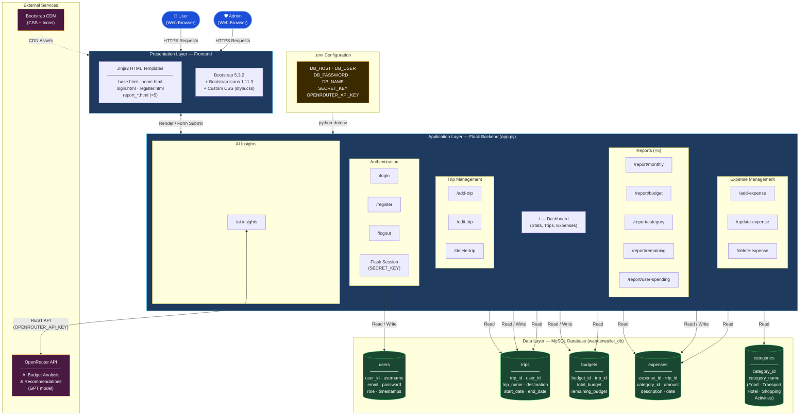
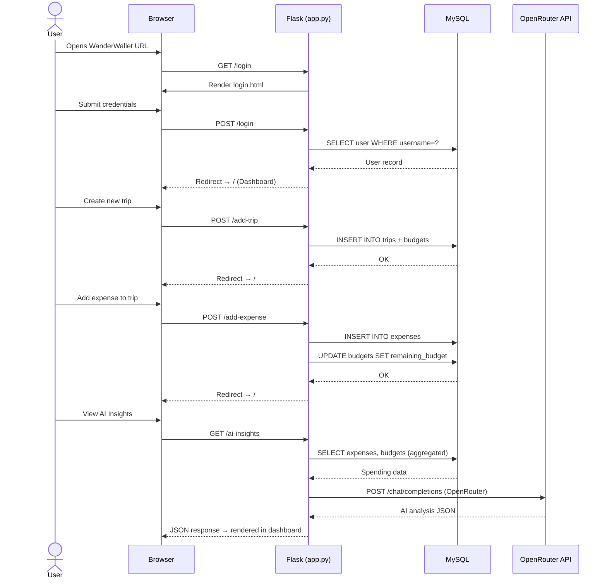
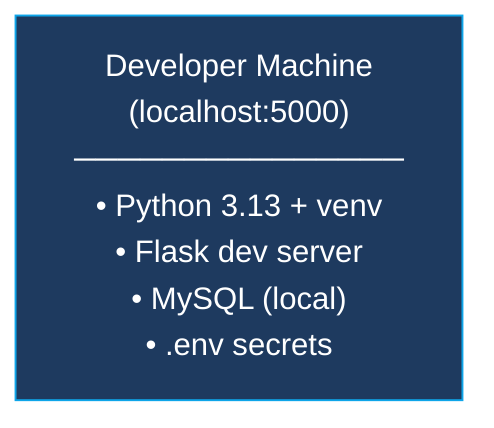

# WanderWallet — System Architecture

## Architecture Overview

WanderWallet follows a traditional **Monolithic MVC** (Model-View-Controller) pattern, hosted on a single server with server-side rendering.

---

## Component Breakdown

### Presentation Layer
| Component | Technology | Role |
|-----------|-----------|------|
| HTML Templates | Jinja2 (9 files) | Server-side rendered views |
| UI Framework | Bootstrap 5.3.2 | Responsive layout & components |
| Icons | Bootstrap Icons 1.11.3 | UI iconography |
| Custom Styles | CSS (`style.css`, 7.7 KB) | Brand colours & overrides |

### Application Layer (Flask — `app.py`)
| Module | Routes | Responsibility |
|--------|--------|---------------|
| Authentication | `/login`, `/register`, `/logout` | Session-based auth (Werkzeug hashing) |
| Dashboard | `/` | Overview stats, trip list, expense log |
| Trip Management | `/add-trip`, `/edit-trip`, `/delete-trip` | CRUD for trips & linked budgets |
| Expense Management | `/add-expense`, `/update-expense`, `/delete-expense` | CRUD for expenses |
| Reports | `/report/monthly`, `/report/budget`, `/report/category`, `/report/remaining`, `/report/user-spending` | Aggregated data views |
| AI Insights | `/ai-insights` | OpenRouter API call → JSON response |

### Data Layer (MySQL — `wanderwallet_db`)
| Table | Key Relationships |
|-------|-------------------|
| `users` | Root entity; owns trips |
| `trips` | Belongs to user; has one budget |
| `budgets` | One-to-one with trips; tracks remaining |
| `expenses` | Belongs to trip & category |
| `categories` | Lookup table (5 predefined types) |

### External Services
| Service | Purpose | Integration |
|---------|---------|-------------|
| OpenRouter API | AI-powered spending analysis | `requests` HTTP POST from `/ai-insights` |
| Bootstrap CDN | UI framework assets | `<link>` tag in `base.html` |

---

## Data Flow — Typical User Journey

---

## Deployment Topology

> **Current state**: Local development only — no production deployment, Docker, or cloud infrastructure configured.
